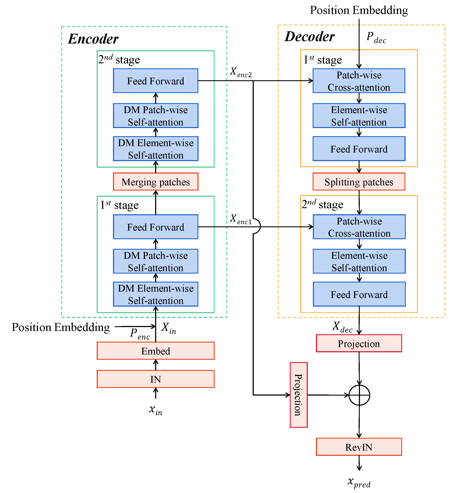
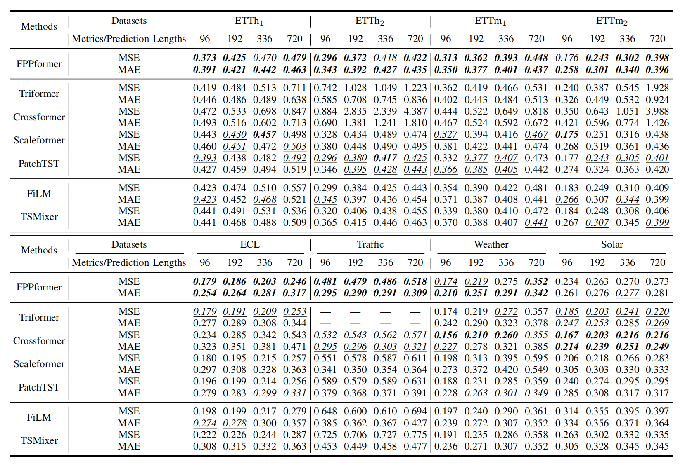
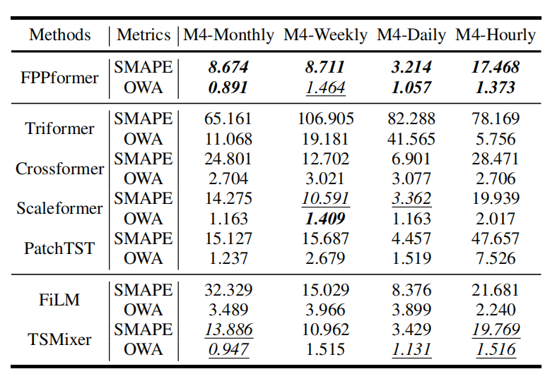
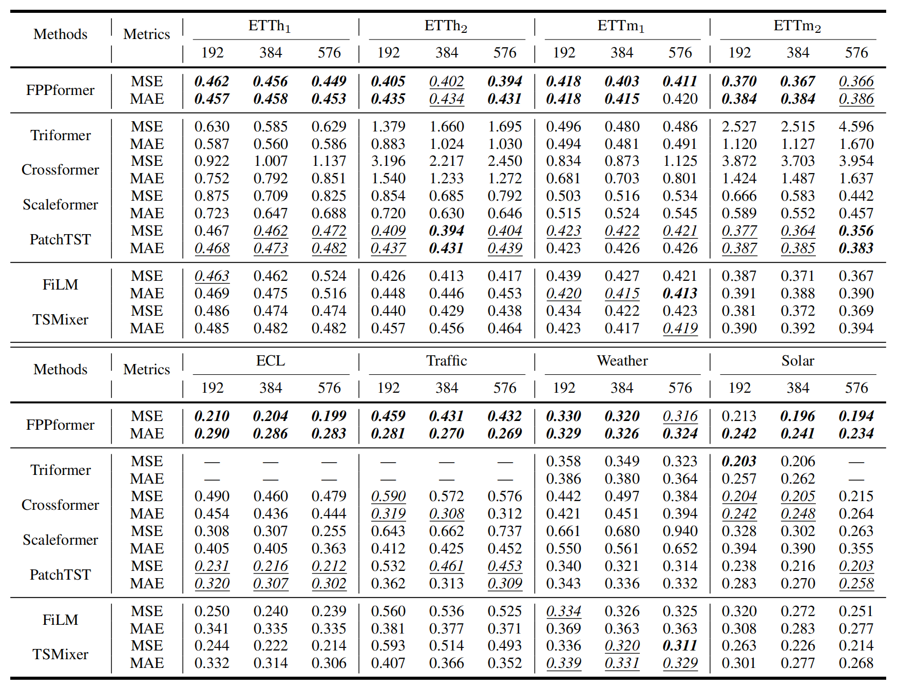
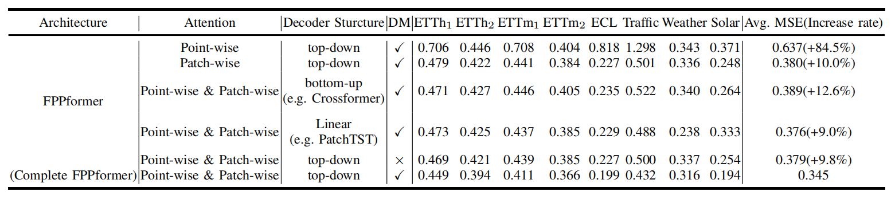
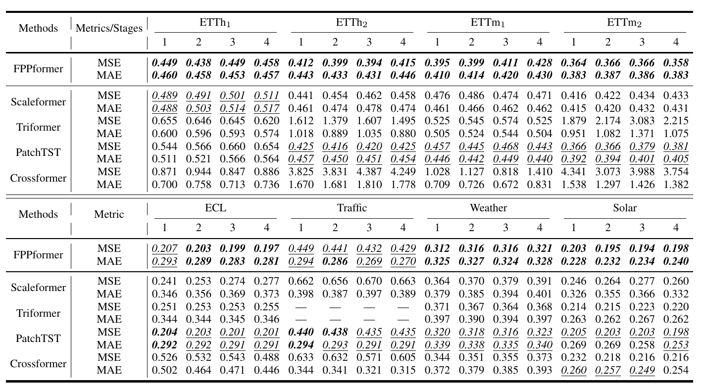

# Take an Irregular Route: Enhance the Decoder of Time-Series Forecasting Transformer


This is the origin Pytorch implementation of FPPformer in the following paper: 
[Take an Irregular Route: Enhance the Decoder of Time-Series Forecasting Transformer] (Manuscript submitted to IEEE IoT).

## The Entire Architecture of FPPformer
The overview of our proposed FPPformer is illustrated in Figure 1 and its major enhancement on vanilla TSFT concentrates on addressing the preceding two problems of decoder.
<p align="center">

<br><br>
<b>Figure 1.</b> An overview of FPPformer’s hierarchical architecture with two-stage encoder and two-stage decoder. Different from the vanilla one, the encoder owns bottom-up structure while the decoder owns top-down structure. Note that the direction of the propagation flow in decoder is opposite to the vanilla one to highlight the top-down structure. 'DM' in the stages of encoder means 'Diagonal-Masked'.
</p>


## Requirements

- Python 3.8.8
- matplotlib == 3.3.4
- numpy == 1.20.1
- pandas == 1.2.4
- scipy == 1.9.0
- scikit_learn == 0.24.1
- torch == 1.11.0

Dependencies can be installed using the following command:
```bash
pip install -r requirements.txt
```

## Data

ETT, ECL, Traffic and weather dataset were acquired at: [here](https://drive.google.com/drive/folders/1ZOYpTUa82_jCcxIdTmyr0LXQfvaM9vIy?usp=sharing). Solar dataset were acquired at: [Solar](https://drive.google.com/drive/folders/1Gv1MXjLo5bLGep4bsqDyaNMI2oQC9GH2?usp=sharing). M4 dataset was acquired at: [M4](https://github.com/Mcompetitions/M4-methods).

### Data Preparation
After you acquire raw data of all datasets, please separately place them in corresponding folders at `./FPPformer/data`. 

We place ETT in the folder `./ETT-data`, ECL in the folder `./electricity`  and weather in the folder `./weather` of [here](https://drive.google.com/drive/folders/1ZOYpTUa82_jCcxIdTmyr0LXQfvaM9vIy?usp=sharing) (the folder tree in the link is shown as below) into folder `./data` and rename them from `./ETT-data`,`./electricity`, `./traffic` and `./weather` to `./ETT`, `./ECL`, `./Traffic` and`./weather` respectively. We rename the file of ECL/Traffic from `electricity.csv`/`traffic.csv` to `ECL.csv`/`Traffic.csv` and rename its last variable from `OT`/`OT` to original `MT_321`/`Sensor_861` separately.

```
The folder tree in https://drive.google.com/drive/folders/1ZOYpTUa82_jCcxIdTmyr0LXQfvaM9vIy?usp=sharing:
|-autoformer
| |-ETT-data
| | |-ETTh1.csv
| | |-ETTh2.csv
| | |-ETTm1.csv
| | |-ETTm2.csv
| |
| |-electricity
| | |-electricity.csv
| |
| |-traffic
| | |-traffic.csv
| |
| |-weather
| | |-weather.csv
```

We place Solar in the folder `./financial` of [here](https://drive.google.com/drive/folders/1Gv1MXjLo5bLGep4bsqDyaNMI2oQC9GH2?usp=sharing) (the folder tree in the link is shown as below) into the folder `./data` and rename them as `./Solar` respectively. 

```
The folder tree in https://drive.google.com/drive/folders/1Gv1MXjLo5bLGep4bsqDyaNMI2oQC9GH2?usp=sharing:
|-dataset
| |-financial
| | |-solar_AL.txt
```

As for M4 dataset, we place the folders `./Dataset` and `./Point Forecasts` of [M4](https://github.com/Mcompetitions/M4-methods) (the folder tree in the link is shown as below) into the folder `./data/M4`. Moreover, we unzip the file `./Point Forecasts/submission-Naive2.rar` to the current directory.

```
The folder tree in https://drive.google.com/drive/folders/1Gv1MXjLo5bLGep4bsqDyaNMI2oQC9GH2?usp=sharing:
|-M4-methods
| |-Dataset
| | |-Test
| | | |-Daily-test.csv
| | | |-Hourly-test.csv
| | | |-Monthly-test.csv
| | | |-Quarterly-test.csv
| | | |-Weekly-test.csv
| | | |-Yearly-test.csv
| | |-Train
| | | |-Daily-train.csv
| | | |-Hourly-train.csv
| | | |-Monthly-train.csv
| | | |-Quarterly-train.csv
| | | |-Weekly-train.csv
| | | |-Yearly-train.csv
| | |-M4-info.csv
| |-Point Forecasts
| | |-submission-Naive2.rar
```

Then you will obtain folder tree:
```
|-data
| |-ECL
| | |-ECL.csv
| |
| |-ETT
| | |-ETTh1.csv
| | |-ETTh2.csv
| | |-ETTm1.csv
| | |-ETTm2.csv
| |
| |-M4
| | |-Dataset
| | | |-Test
| | | | |-Daily-test.csv
| | | | |-Hourly-test.csv
| | | | |-Monthly-test.csv
| | | | |-Quarterly-test.csv
| | | | |-Weekly-test.csv
| | | | |-Yearly-test.csv
| | | |-Train
| | | | |-Daily-train.csv
| | | | |-Hourly-train.csv
| | | | |-Monthly-train.csv
| | | | |-Quarterly-train.csv
| | | | |-Weekly-train.csv
| | | | |-Yearly-train.csv
| | | |-M4-info.csv
| | |-Point Forecasts
| | | |-submission-Naive2.csv
| |
| |-Solar
| | |-solar_AL.txt
| |
| |-Traffic
| | |-Traffic.csv
| |
| |-weather
| | |-weather.csv

```

## Baseline
We select seven typical deep time series forecasting models, i.e., Triformer, Crossformer, Scaleformer, PatchTST, FiLM and TSMixer as baselines in multivariate/univariate forecasting experiments. Their source codes origins are given below:

| Baseline | Source Code |
|:---:|:---:|
| Triformer | [https://github.com/razvanc92/triformer](https://github.com/razvanc92/triformer) |
| Crossformer | [https://github.com/Thinklab-SJTU/Crossformer](https://github.com/Thinklab-SJTU/Crossformer) |
| Scaleformer | [https://github.com/BorealisAI/scaleformer](https://github.com/BorealisAI/scaleformer) |
| PatchTST | [https://github.com/yuqinie98/PatchTST](https://github.com/yuqinie98/PatchTST) |
| FiLM | [https://github.com/tianzhou2011/FiLM](https://github.com/tianzhou2011/FiLM) |
| TSMixer | [https://github.com/google-research/google-research/tree/master/tsmixer](https://github.com/google-research/google-research/tree/master/tsmixer) |


Moreover, the default experiment settings/parameters of aforementioned seven baselines are given below respectively:

<table>
<tr>
<th>Baselines</th>
<th>Settings/Parameters name</th>
<th>Descriptions</th>
<th>Default mechanisms/values</th>
</tr>
<tr>
<th rowspan=6>Triformer</th>
<th>num_nodes</th>
<th>The number of nodes</th>
<th>4</th>
</tr>
<tr>
<th>patch_sizes</th>
<th>The patch size</th>
<th>4</th>
</tr>
<tr>
<th>d_model</th>
<th>The number of hidden dimensions</th>
<th>32</th>
</tr>
<tr>
<th>mem_dim</th>
<th>The dimension of memory vector</th>
<th>5</th>
</tr>
<tr>
<th>e_layers</th>
<th>The number of encoder layers</th>
<th>2</th>
</tr>
<tr>
<th>d_layers</th>
<th>The number of decoder layers</th>
<th>1</th>
</tr>
<tr>
<th rowspan=5>Crossformer</th>
<th>seq_len</th>
<th>Segment length (L_seq)</th>
<th>6</th>
</tr>
<tr>
<th>d_model</th>
<th>The number of hidden dimensions</th>
<th>64</th>
</tr>
<tr>
<th>d_ff</th>
<th>Dimension of fcn</th>
<th>128</th>
</tr>
<tr>
<th>n_heads</th>
<th>The number of heads in multi-head attention mechanism</th>
<th>2</th>
</tr>
<tr>
<th>e_layers</th>
<th>The number of encoder layers</th>
<th>2</th>
</tr>
<tr>
<th rowspan=2>Scaleformer</th>
<th>scales</th>
<th>Scales in multi-scale</th>
<th>[16, 8, 4, 2, 1]</th>
</tr>
<tr>
<th>scale_factor</th>
<th>Scale factor for upsample</th>
<th>2</th>
</tr>
<tr>
<th rowspan=2>PatchTST</th>
<th>patch_len</th>
<th>Patch length</th>
<th>16</th>
</tr>
<tr>
<th>stride</th>
<th>The stride length</th>
<th>8</th>
</tr>
<tr>
<th rowspan=6>FiLM</th>
<th>d_model</th>
<th>The number of hidden dimensions</th>
<th>512</th>
</tr>
<tr>
<th>d_ff</th>
<th>Dimension of fcn</th>
<th>2048</th>
</tr>
<tr>
<th>n_heads</th>
<th>The number of heads in multi-head attention mechanism</th>
<th>8</th>
</tr>
<tr>
<th>e_layers</th>
<th>The number of encoder layers</th>
<th>2</th>
</tr>
<tr>
<th>d_layers</th>
<th>The number of decoder layers</th>
<th>1</th>
</tr>
<tr>
<th>modes1</th>
<th>The number of Fourier modes to multiply</th>
<th>32</th>
</tr>
<tr>
<th rowspan=2>TSMixer</th>
<th>n_block</th>
<th>The number of block for deep architecture</th>
<th>2</th>
</tr>
<tr>
<th>d_model</th>
<th>The hidden feature dimension</th>
<th>64</th>
</tr>
</table>


## Usage
Commands for training and testing FPPformer of all datasets are in `./scripts/Main.sh`.

More parameter information please refer to `main.py`.

We provide a complete command for training and testing FPPformer:

For multivariate forecasting:
```
python -u main.py --data <data> --features <features> --input_len <input_len> --pred_len <pred_len> --encoder_layer <encoder_layer> --patch_size <patch_size> --d_model <d_model> --learning_rate <learning_rate> --dropout <dropout> --batch_size <batch_size> --train_epochs <train_epochs> --patience <patience> --itr <itr> --train
```
For univariate forecasting:
```
python -u main_M4.py --data <data> --freq <freq> --input_len <input_len> --pred_len <pred_len> --encoder_layer <encoder_layer> --patch_size <patch_size> --d_model <d_model> --learning_rate <learning_rate> --dropout <dropout> --batch_size <batch_size> --train_epochs <train_epochs> --patience <patience> --itr <itr> --train
```

Here we provide a more detailed and complete command description for training and testing the model:

| Parameter name |                                          Description of parameter                                          |
|:--------------:|:----------------------------------------------------------------------------------------------------------:|
|      data      |                                              The dataset name                                              |
|   root_path    |                                       The root path of the data file                                       |
|   data_path    |                                             The data file name                                             |
|    features    | The forecasting task. This can be set to `M`,`S` (M : multivariate forecasting, S : univariate forecasting |
|     target     |                                         Target feature in `S` task                                         |
|      freq      |                                   Sampling frequency for M4 sub-datasets                                   |
|  checkpoints   |                                       Location of model checkpoints                                        |
|   input_len    |                                           Input sequence length                                            |
|    pred_len    |                                         Prediction sequence length                                         |
|     enc_in     |                                                 Input size                                                 |
|    dec_out     |                                                Output size                                                 |
|    d_model     |                                             Dimension of model                                             |
| representation |                      Representation dims in the end of the intra-reconstruction phase                      |
|    dropout     |                                                  Dropout                                                   |
| encoder_layer  |                                        The number of encoder layers                                        |
|   patch_size   |                                           The size of each patch                                           |
|      itr       |                                             Experiments times                                              |
|  train_epochs  |                                      Train epochs of the second stage                                      |
|   batch_size   |                         The batch size of training input data in the second stage                          |
|    patience    |                                          Early stopping patience                                           |
| learning_rate  |                                          Optimizer learning rate                                           |


## Results
The experiment parameters of each data set are formated in the `Main.sh` files in the directory `./scripts/`. You can refer to these parameters for experiments, and you can also adjust the parameters to obtain better mse and mae results or draw better prediction figures. We provide the commands for obtain the results of FPPformer with longer input sequence lengths in the file `./scripts/LongInput.sh` and those of FPPformer with different encoder layers  in the file `./scripts/ParaSen.sh`. 

<p align="center">

<br><br>
<b>Figure 2.</b> Multivariate forecasting results
</p>

<p align="center">

<br><br>
<b>Figure 3.</b> Univariate forecasting results
</p>

### Full results
Moreover, we present the full results of multivariate forecasting results with long input sequence lengths in Figure 4, that of ablation study in Figure 5 and that of parameter sensitivity in Figure 6.
<p align="center">

<br><br>
<b>Figure 4.</b> Multivariate forecasting results with long input lengths
</p>
<p align="center">

<br><br>
<b>Figure 5.</b> Ablation results with the prediction length of 720
</p>
<p align="center">

<br><br>
<b>Figure 6.</b> Results of parameter sensitivity on stage numbers
</p>

## Contact
If you have any questions, feel free to contact Li Shen through Email (shenli@buaa.edu.cn) or Github issues. Pull requests are highly welcomed!
